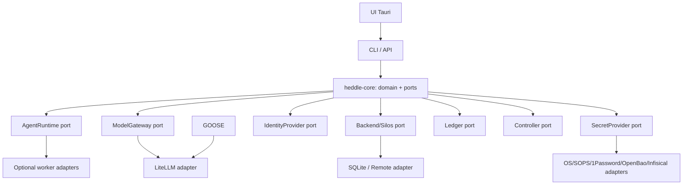

# Architecture Spine — Heddle

## Design Paradigm
**Hexagonal (ports & adapters)** + **event sourcing**. The core (agentic domain) depends only on **ports** (traits); external building blocks are interchangeable **adapters**. State is derived from an **immutable event log** (Ledger).

Layers → directories: `crates/heddle-core/` (domain + ports), `crates/heddle-*-adapter*` & `connectors/` (adapters), `crates/heddle-cli/` + `ui/` (surfaces), `sidecar/` (Python), `gateway/` (LiteLLM).

## Invariants & Rules

### AD-1 — Headless core; CLI is authoritative; UI as an overlay
- **Binds:** all surfaces (FR-1)
- **Prevents:** UI-exclusive capabilities that cannot be automated or tested.
- **Rule:** every capability goes through the core API; the CLI exposes it in full; the UI only emits CLI/API commands. [ADOPTED]

### AD-2 — Per-silo isolation at I/O boundaries
- **Binds:** FR-6, FR-10, FR-11, backend
- **Prevents:** data leakage between modes/teams.
- **Rule:** all data access is resolved via `Backend.store(mode, team)`; reads/writes are confined; no cross-silo queries. Enforced by an isolation test. [ADOPTED]

### AD-3 — Inverted coupling through ports
- **Binds:** connectors, providers, identity, secrets, controller
- **Prevents:** dependency of the core on a concrete implementation.
- **Rule:** the core knows only the traits `AgentRuntime`, `ModelGateway`, `Backend`, `IdentityProvider`, `SecretProvider`, `Controller`, `Ledger`; concrete implementations are injected.

### AD-4 — Egress governed by mode
- **Binds:** FR-3, FR-11, security
- **Prevents:** unintended network egress in Local mode.
- **Rule:** in Local mode, only adapters with `requires_network()==false` may be used; cloud egress requires Server/Remote mode plus an explicit policy. [ADOPTED]

### AD-5 — Append-only traceability, secrets by reference
- **Binds:** FR-10, FR-11
- **Prevents:** loss of traceability; secrets in cleartext within logs.
- **Rule:** every step is logged (Ledger, hash-chained); secrets are references resolved JIT and **redacted** before any persistence/log.

### AD-6 — Deny-by-default authorization across 3 scopes
- **Binds:** FR-8, FR-7
- **Prevents:** implicit access.
- **Rule:** RBAC evaluated global → silo → intra-silo; deny by default; harness locks = intra-silo permissions.

### AD-7 — Event-sourced workflow on the Ledger
- **Binds:** FR-13
- **Prevents:** non-resumable / non-traceable orchestration; a proprietary engine being tightly coupled.
- **Rule:** every workflow executes by logging each step as a Ledger `Step`; resumption happens from the last Step; the concrete engine sits behind the `WorkflowEngine` trait (native by default; Temporal/Windmill optional).

### AD-9 — Engine-enforced loop control (loop engineering)
- **Binds:** FR-16, FR-13, FR-1
- **Prevents:** runaway loops; reflect/retry that trusts model self-judgment (unreliable, can degrade output).
- **Rule:** every agent loop / loop node runs under a `LoopController` — termination/budgets are engine-enforced (the model never decides to stop), and reflect/retry is anchored to external ground truth (tests/compiler/linters/tool results). Loop state + reflections persist to the Ledger (AD-5, AD-7); breaches escalate to a human (AD-6, §7.4). Verify at 3 levels: action / iteration / terminal.

### AD-8 — Hierarchical value resolution, explicit locks and security floors
- **Binds:** FR-14, FR-15, FR-7 (harness), FR-3/FR-11 (egress/secrets)
- **Prevents:** config divergence between levels; bypassing a higher-level lock.
- **Rule:** config is resolved along Silo▸Team▸Project▸Conversation. Without a lock, the most specific value wins. An explicit higher-scope lock caps lower scopes. Security constraints are monotonic floors: lower scopes may tighten but not weaken them. A single resolver governs harness/tracker/egress/providers/secrets and remains bounded to the silo (AD-2).

### AD-10 — Heddle owns control; workers are replaceable
- **Binds:** FR-1, FR-13, FR-16, FR-18
- **Prevents:** an external runtime hiding model/tool events or becoming the source of truth for policy, workflow state, evidence or completion.
- **Rule:** the Rust control plane owns the loop and canonical state. Workers are invoked through a versioned contract and are accepted only when the required turn-level events, correlation, approvals and termination controls are observable and enforceable. See ADR-0003.

### AD-11 — Context is selected, reproducible and budgeted
- **Binds:** FR-17, FR-10
- **Prevents:** repository dumping, untraceable summaries and exhaustion of output/tool-result headroom.
- **Rule:** each model call persists a `ContextManifest`; smallest-sufficient retrieval is the default; full-context loading is explicit and benchmark-gated. Source hashes and selection rationale are Ledger-linked.

### Allowed dependencies (who may depend on whom)



## Consistency Conventions

| Concern | Convention |
| --- | --- |
| Naming | crates `heddle-*`; traits in `PascalCase` (`AgentRuntime`); modules `snake_case` |
| Data & formats | session ids `s%06d`; epoch timestamps (i64); errors via `HeddleError` (thiserror); JSON for persisted payloads |
| State & cross-cutting | mutation via event append (Ledger); logging with `tracing`/OpenTelemetry; versioned config-as-code; deny-by-default auth; secrets by reference |

## Stack

| Name | Version |
| --- | --- |
| Rust | 1.79 (MSRV) |
| Heddle control plane | Rust, version pinned by workspace toolchain |
| Agent workers | Optional adapters (Goose, OpenCode, Cline, Hermes, Claude Code, others) |
| LiteLLM | proxy (100+ providers) |
| SQLite (rusqlite) | 0.31 (bundled) |
| Tauri | 2.x (UI, v1+) |
| Python (sidecar) | 3.11+ (uv) |
| OpenTelemetry | via `tracing` |

## Structural Seed

```text
heddle/
  crates/
    heddle-core/   # domain + ports (traits) + local implementations
    heddle-cli/    # reference surface (bin `heddle`)
  connectors/     # MCP servers (Atlassian, M365, fs, git, shell)
  gateway/        # LiteLLM config
  sidecar/        # Python (embeddings/RAG, v2+)
  ui/             # Tauri (v1 Chat+Code)
  _bmad-output/   # BMAD artifacts (planning/implementation)
  specs/          # Spec-Kit artifacts (per-feature)
  .specify/       # Spec-Kit constitution + templates + workflows
```

## Capability → Architecture Map

| Capability / FR | Lives in | Governed by |
| --- | --- | --- |
| FR-1 agentic loop | heddle-core + optional worker adapters | AD-1, AD-3, ADR-0003 |
| FR-3 multi-provider | ModelGateway port + LiteLLM | AD-3, AD-4 |
| FR-6 modes/silos | Backend port + ModeSupervisor | AD-2 |
| FR-8 identity/RBAC | IdentityProvider port + RBAC | AD-6 |
| FR-10 ledger | Ledger port + Gateway capture | AD-5 |
| FR-11 secrets | SecretProvider port | AD-4, AD-5 |
| FR-12 cowork/multimodal | Controller port + typed Content | AD-3 |
| FR-17 context management | ContextManager + ContextManifest + retrieval adapters | AD-5, AD-11 |
| FR-18 governed workers | WorkerAdapter + CapabilityRegistry | AD-3, AD-10, ADR-0003 |
| FR-13 workflow | WorkflowEngine port + Ledger | AD-7, AD-5 |
| FR-14 task tracking | TaskTracker port (local/Vikunja/Jira) | AD-3, AD-8 |
| FR-15 hierarchy/config | Silo▸Team▸Project▸Conversation resolver | AD-8, AD-2 |

## Deferred
- Python/RAG sidecar, full Tauri UI, networked Server/Remote modes, external IdPs, multimodal v2+, v7 duplex channel: pushed to their respective versions (see PRD §6 & design §8). The *initiative* altitude establishes the invariants; each epic/feature spine will inherit the ADs above through their original ids.
