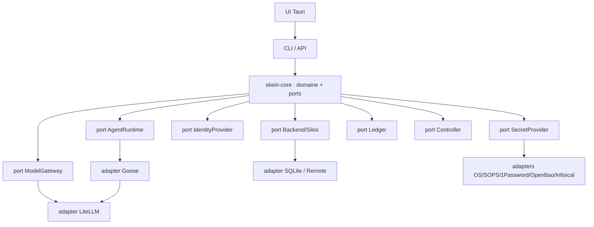

# Architecture Spine — Skein

## Design Paradigm
**Hexagonal (ports & adapters)** + **event sourcing**. Le cœur (domaine agentique) ne dépend que de **ports** (traits) ; les briques externes sont des **adapters** interchangeables. L'état est dérivé d'un **journal d'événements immuable** (Ledger).

Layers → répertoires : `crates/skein-core/` (domaine + ports), `crates/skein-*-adapter*` & `connectors/` (adapters), `crates/skein-cli/` + `ui/` (surfaces), `sidecar/` (Python), `gateway/` (LiteLLM).

## Invariants & Rules

### AD-1 — Cœur headless ; CLI faisant foi ; UI surcouche
- **Binds :** all surfaces (FR-1)
- **Prevents :** capacités exclusives à l'UI, non automatisables/testables.
- **Rule :** toute capacité passe par l'API du cœur ; la CLI l'expose intégralement ; l'UI n'émet que des commandes CLI/API. [ADOPTED]

### AD-2 — Isolation par silo aux bornes d'E/S
- **Binds :** FR-6, FR-10, FR-11, backend
- **Prevents :** fuite de données entre modes/équipes.
- **Rule :** tout accès data est résolu via `Backend.store(mode, team)` ; lecture/écriture confinées ; aucune requête cross-silo. Testé par un test d'isolation. [ADOPTED]

### AD-3 — Couplage inversé par ports
- **Binds :** connecteurs, providers, identité, secrets, controller
- **Prevents :** dépendance du cœur à une implémentation concrète.
- **Rule :** le cœur ne connaît que les traits `AgentRuntime`, `ModelGateway`, `Backend`, `IdentityProvider`, `SecretProvider`, `Controller`, `Ledger` ; les concrets sont injectés.

### AD-4 — Egress gouverné par le mode
- **Binds :** FR-3, FR-11, sécurité
- **Prevents :** sortie réseau non voulue en mode Local.
- **Rule :** en mode Local, seuls les adapters `requires_network()==false` sont utilisables ; egress cloud exige Serveur/Remote + politique explicite. [ADOPTED]

### AD-5 — Traçabilité append-only, secrets par référence
- **Binds :** FR-10, FR-11
- **Prevents :** perte de traçabilité ; secrets en clair dans les journaux.
- **Rule :** chaque étape est journalisée (Ledger, hash-chaîné) ; les secrets sont des références résolues JIT, **rédigées** avant toute persistance/log.

### AD-6 — Autorisation deny-by-default à 3 portées
- **Binds :** FR-8, FR-7
- **Prevents :** accès implicite.
- **Rule :** RBAC évalué globale → silo → intra-silo ; refus par défaut ; verrous harness = permissions intra-silo.

### Dépendances autorisées (qui peut dépendre de qui)



## Consistency Conventions

| Concern | Convention |
| --- | --- |
| Naming | crates `skein-*` ; traits en `PascalCase` (`AgentRuntime`) ; modules `snake_case` |
| Data & formats | ids de session `s%06d` ; timestamps epoch (i64) ; erreurs via `SkeinError` (thiserror) ; JSON pour les payloads persistés |
| State & cross-cutting | mutation via event append (Ledger) ; logging `tracing`/OpenTelemetry ; config-as-code versionnée ; auth deny-by-default ; secrets par référence |

## Stack

| Name | Version |
| --- | --- |
| Rust | 1.79 (MSRV) |
| Goose | dépendance upstream (v6.x) |
| LiteLLM | proxy (100+ providers) |
| SQLite (rusqlite) | 0.31 (bundled) |
| Tauri | 2.x (UI, v1+) |
| Python (sidecar) | 3.11+ (uv) |
| OpenTelemetry | via `tracing` |

## Structural Seed

```text
skein/
  crates/
    skein-core/   # domaine + ports (traits) + implémentations locales
    skein-cli/    # surface de référence (bin `skein`)
  connectors/     # serveurs MCP (Atlassian, M365, fs, git, shell)
  gateway/        # config LiteLLM
  sidecar/        # Python (embeddings/RAG, v2+)
  ui/             # Tauri (v1 Chat+Code)
  _bmad-output/   # artefacts BMAD (planning/implementation)
  specs/          # artefacts Spec-Kit (per-feature)
  .specify/       # constitution + templates + workflows Spec-Kit
```

## Capability → Architecture Map

| Capability / FR | Lives in | Governed by |
| --- | --- | --- |
| FR-1 boucle agentique | skein-core + adapter Goose | AD-1, AD-3 |
| FR-3 multi-provider | port ModelGateway + LiteLLM | AD-3, AD-4 |
| FR-6 modes/silos | port Backend + ModeSupervisor | AD-2 |
| FR-8 identité/RBAC | port IdentityProvider + RBAC | AD-6 |
| FR-10 ledger | port Ledger + capture Gateway | AD-5 |
| FR-11 secrets | port SecretProvider | AD-4, AD-5 |
| FR-12 cowork/multimodal | port Controller + Content typé | AD-3 |

## Deferred
- Sidecar Python/RAG, UI Tauri complète, modes Serveur/Remote réseau, IdP externes, multimodal v2+, canal duplex v7 : poussés à leurs versions (voir PRD §6 & design §8). L'altitude *initiative* pose les invariants ; chaque epic/feature spine héritera des ADs ci-dessus par leurs ids d'origine.
