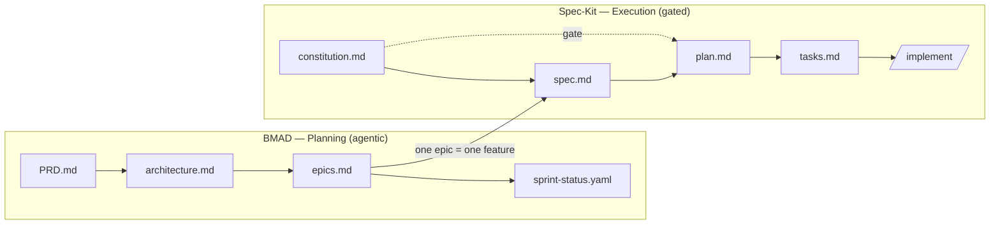

# Skein Methodology — BMAD × Spec-Kit Bridge (dogfooding)

Skein is **built with the very methods it integrates** (dogfooding). We apply the **bridge** BMAD × Spec-Kit: **BMAD plans**, **Spec-Kit executes**. Both frameworks are actually installed in this repository.

## The flow (bridge)

- **BMAD** produces high-fidelity planning artifacts (analyst/PM/architect): `_bmad-output/planning-artifacts/{PRD.md, architecture.md, epics.md}` + `_bmad-output/implementation-artifacts/sprint-status.yaml`.
- **Spec-Kit** executes each epic as a gated *feature*: `.specify/memory/constitution.md` (immutable principles, gate) → `specs/[###-feature]/{spec.md, plan.md, tasks.md}` → `/speckit-implement`.
- BMAD rule enforced: **clean context per phase**, memory kept in files (not in the chat).

## Installed tooling (real)

| Framework | Installed via | Location |
|---|---|---|
| Spec-Kit | `uvx … specify init --here --integration claude` | `.specify/` + skills `.claude/skills/speckit-*` |
| BMAD-METHOD v6.10 | `npx bmad-method@latest install --modules bmm --tools claude-code` | `_bmad/`, `_bmad-output/` + skills `.claude/skills/bmad-*` |

Available commands (within an agent): Spec-Kit `/speckit-constitution|specify|plan|tasks|implement`; BMAD `bmad-create-prd`, `bmad-create-architecture`, `bmad-create-epics-and-stories`, agents `bmad-agent-{analyst,pm,architect,dev}`, etc.

## Artifact mapping

| Content | BMAD (planning) | Spec-Kit (execution) | Exhaustive reference (superpowers) |
|---|---|---|---|
| Immutable principles | (within PRD/arch) | `.specify/memory/constitution.md` | design §1-§7 |
| What / why | `PRD.md` | `specs/001-*/spec.md` | design §1, §8 |
| How (architecture) | `architecture.md` | `specs/001-*/plan.md` | design §3-§7 |
| Breakdown | `epics.md` + `sprint-status.yaml` | `specs/001-*/tasks.md` | plan Phase 0 (bite-sized) |

**Honest compliance note:** the `docs/superpowers/specs|plans/` documents (produced by the brainstorming→writing-plans flow) remain the **exhaustive reference** (complete TDD code for each step). The BMAD/Spec-Kit artifacts above are the **compliant view** for both frameworks, derived from that reference. In case of divergence, the constitution + the PRD take precedence over intent; the superpowers plan takes precedence over implementation detail.

## Reference bridge
Documented hybrid pattern (BMAD plans → Spec-Kit executes) and a concrete implementation: `oimiragieo/BMAD-SPEC-KIT`. See also the official docs: `github/spec-kit`, `docs.bmad-method.org`.
